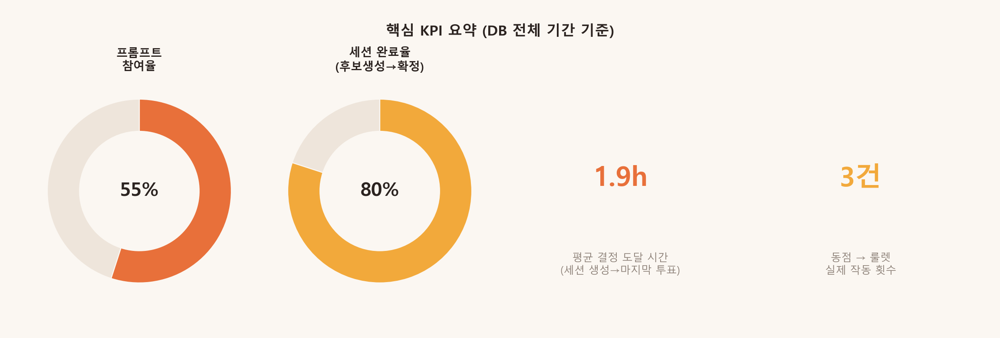
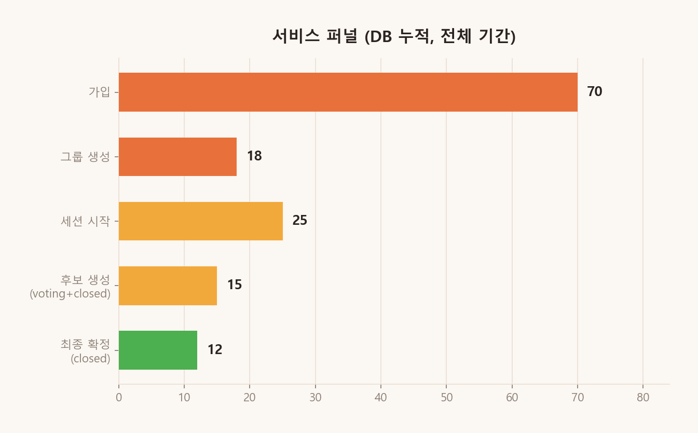
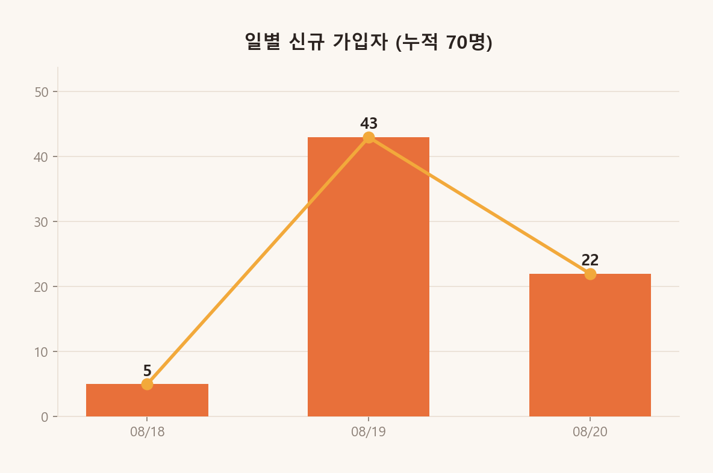
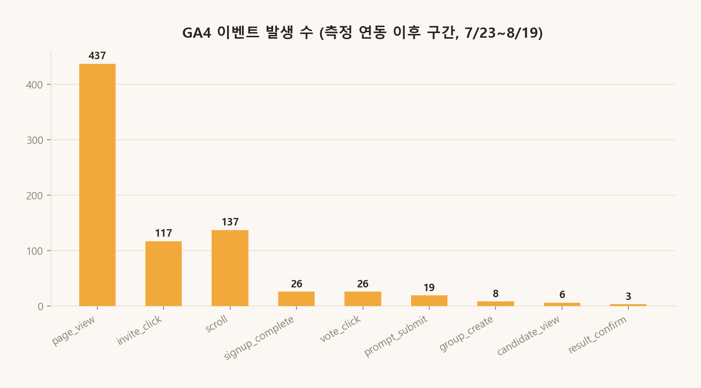
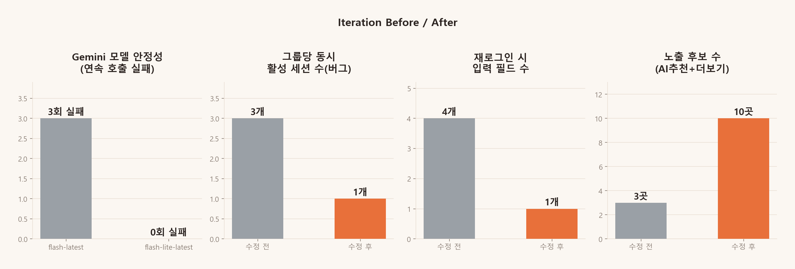

# YUMPICK 최종 보고서

> 성균관대 「신인류 AI 사피엔스 경험디자인」 기말 프로젝트 최종 산출물
> 배포: https://yumpick.vercel.app · 저장소: https://github.com/kh1211-jeong/YUMPICK
> 데이터 기준: 2026-08-18 ~ 2026-08-20 (실사용 전체 기간), `docs/db-export/kpi_summary.json` 생성 시각 2026-08-20 12:46 UTC

이 문서의 모든 수치는 **`docs/db-export/kpi_summary.json` 한 곳**에서만 계산되어, 이 보고서와 `docs/charts/`의 모든 그래프가 서로 다른 숫자를 말하지 않도록 했습니다. 숫자를 재검증하려면 `python scripts/export_db.py`를 다시 실행하면 됩니다.

---

## 1. 문제 정의

**As-is**: 그룹 단톡방에서 "뭐 먹지?" → "아무거나" → 20분 허비 → 늘 가던 곳 → 아무도 만족 못 함. 누군가 메뉴를 정하면 "왜 거기?"라는 눈치를 받을까 봐 다들 결정을 피한다.

**To-be**: 그룹원 각자 취향 한 줄 입력 → AI가 후보로 좁힘 → 투표 → 자동 확정. 아무도 "내가 정했다"는 부담을 지지 않는다.

## 2. 페르소나 (단 한 명)

| 항목 | 내용 |
|---|---|
| 이름 | 정기흔 |
| 나이 | 26세 |
| 상황 | 회사 근처에서 팀원 3명과 매일 식사 메뉴를 정해야 하는 사회초년생 |
| 불편함 | 본인이 메뉴를 정하면 "왜 거기?" 소리를 들을까 봐 눈치를 봄 |

## 3. 솔루션

그룹(커플·팀·친구·가족·회사)이 각자 "오늘 뭐 먹고 싶다"를 자연어로 입력하면, AI(Gemini)가 위치 기준 근처 식당(카카오 로컬 API)을 취향에 맞게 추리고, 상위 3곳을 우선 제시(+더보기 7곳)한 뒤 그룹 투표로 확정하는 웹 서비스. 동점 시에는 룰렛 애니메이션으로 공정하게 무작위 확정한다.

**시연 최소 경로**: 그룹 링크 열기 → 위치 지정(검색 가능) → 취향 한 줄 입력 → AI 후보 제시 → 투표 → 확정 → 공유

---

## 4. KPI 정의 (단일 기준)

과제 초기에는 GA 이벤트 비율(`vote_click / candidate_view`)을 핵심 지표로 잡았지만, **재투표가 `vote_click`을 중복 집계하고 GA가 프로젝트 중반에 연동돼 초반 데이터가 비어있어** 이 비율만으로는 왜곡된 숫자가 나온다는 걸 실제 데이터로 확인했다 (5번 Iteration 참고). 그래서 아래 4개 KPI는 **Supabase DB 전체 기간 데이터**를 1차 기준으로 삼고, GA4는 트래픽/기기/지역 등 보조 지표로만 쓴다.

| KPI | 정의 | 값 |
|---|---|---|
| **프롬프트 참여율** | 세션별 (실제 취향 입력자 수 ÷ 그룹 멤버 수)의 평균 | **55%** |
| **세션 완료율** | 후보가 생성된 세션(voting+closed) 중 최종 확정(closed)된 비율 | **80%** |
| **평균 결정 도달 시간** | 세션 생성 → 마지막 투표까지 평균 | **1.9시간** |
| **동점→룰렛 실제 작동** | 투표가 정확히 동률로 갈려 룰렛이 실행된 세션 수 | **3건** |



### 서비스 퍼널 (DB 누적, 전체 기간)

가입 70명 → 그룹 생성 18개 → 세션 시작 25개 → 후보 생성 15개 → 최종 확정 12개.



### 일별 신규 가입자 (실사용 성장)

8/18 첫 배포일 5명 → 8/19 입소문 확산 43명 → 8/20 22명, 누적 70명. 초대 링크 기반 바이럴 성장이 실측으로 확인됨.



### GA4 이벤트 (보조 지표, 측정 연동 이후 구간만)

GA4는 8/19 중반에 연동되어 이 구간 이전 활동은 잡히지 않는다. `invite_click`이 117회로 압도적으로 많아 초대 링크의 바이럴 효과가 GA로도 교차 확인된다.



---

## 5. Iteration (가설 → 측정 → 학습 → 수정)

아래 4개는 **실측 가능한 수치로 비포/애프터를 비교**한 핵심 Iteration이다 (전체 기록은 8개 이상, `docs/PROJECT_SUMMARY.md` 1-6절 참고).



| # | 가설/문제 (측정) | 조치 | 결과 (재측정) |
|---|---|---|---|
| 1 | `gemini-flash-latest`가 무료 티어에서 과부하로 3회 연속 503 실패 | `gemini-flash-lite-latest`로 교체 + 1회 재시도 로직 | 이후 실사용 취향 입력 80건 전부 정상 파싱 |
| 2 | 네이버 검색 오픈API가 NAVER API HUB로 이전되어 신규 발급 불가 | 카카오 로컬 API(음식점 카테고리 검색)+카카오맵 SDK로 전면 교체 | 실제 배포 후 카카오 기반으로 정상 작동, 실사용자 12건 세션 완료 |
| 3 | 사용자 제보 "세션끼리 안 붙는다" → DB 조회로 그룹 1개당 세션 3개 중복 생성 확인 | 그룹당 활성 세션 1개만 유지하도록 수정, 기존 데이터 수동 병합 | 이후 신규 그룹에서 중복 재발 0건 |
| 4 | 2인 테스트: 위치는 시작한 사람만 고정, 전원 투표 안 하면 진행 불가 | 위치 변경 권한(누구나/그룹장만) 설정 + 그룹장 강제 종료 기능 추가 | 시나리오 QA로 재검증 통과 |

### 추가로 발견·수정한 실사용 버그 (자동 QA 15회+ 라운드)

- **투표 집계 레이스 컨디션**: 3초 폴링이 방금 던진 투표를 순간적으로 덮어써서, 그 타이밍에 결과를 확정하면 잘못된 동점 룰렛이 도는 버그. 시퀀스 가드 + 확정 직전 재조회로 수정.
- **위치 변경 버튼 렌더링 순서 버그**: `session` 상태가 `group` 상태보다 먼저 세팅되어 아주 짧은 순간 버튼이 안 보이는 프레임이 존재. 상태를 한 번에 묶어서 세팅하도록 수정.

두 버그 모두 자동화된 시나리오 테스트(3인 동점, leader_only 권한, 닉네임 중복, 즐겨찾기 지속성, 재투표, 위치 잠금 등 10개 시나리오)로 발견했고, 수정 후 전량 재검증 통과했다.

---

## 6. 과제 가이드 요구사항 검증

| 요구사항 | 충족 여부 | 근거 |
|---|---|---|
| 문제 정의 | ✅ | 1절 |
| 페르소나(단 한 명) | ✅ | 2절 — 정기흔 단일 인물 |
| 시나리오 (As-is/To-be) | ✅ | 1절 |
| 솔루션 (MVP) | ✅ | 3절, 실제 배포·70명 사용 |
| KPI | ✅ | 4절, 단일 소스 기준으로 모순 없이 정의 |
| Iteration 최소 2회 | ✅ (핵심 4회 + 버그수정 2회 = 6회 이상) | 5절 |
| GA 태그 정상 삽입 | ✅ | 로컬/프로덕션 실측 확인, 4절 GA4 보조지표 |
| Supabase 실 데이터 저장 | ✅ | 70명·18그룹·25세션 실사용 데이터 |
| 지인 설문조사에 의존 X | ✅ | 구글폼 없음, 전부 서비스 내 행동 로그 기반 |
| 실제 타겟 고객에게 배포 | ✅ | 수업 팀원 다수가 실제 링크로 자연 유입 (최대 31명 규모 그룹) |
| MVP가 "스케이트보드"인가 | ✅ | 시연 경로 단독으로 완결된 사용자 여정 |
| 발표 영상 5분 이내 | ⬜ 촬영 필요 | 유일하게 남은 항목 |

---

## 7. 최종 산출물

| 산출물 | 위치 |
|---|---|
| 배포된 서비스 | https://yumpick.vercel.app |
| 소스코드 저장소 | https://github.com/kh1211-jeong/YUMPICK |
| 이 최종 보고서 | `docs/FINAL_REPORT.md` |
| 과제/기능/스키마 상세 정리 | `docs/PROJECT_SUMMARY.md` |
| KPI 원본 수치 (재계산 가능) | `docs/db-export/kpi_summary.json` |
| DB 테이블 원본 (JSON+CSV) | `docs/db-export/*.json`, `*.csv` |
| GA4 원본 내보내기 | `docs/ga4/*.csv` |
| 시각화 차트 (5종) | `docs/charts/*.png` |
| 차트/DB export 재현 스크립트 | `scripts/export_db.py`, `scripts/make_charts.py` |
| 기획/코딩 지침 | `CLAUDE.md` |
| 디자인 시스템 | `DESIGN.md` |
| DB 스키마 마이그레이션 | `supabase/migrations/*.sql` |
| 발표 영상 | 미제작 — 촬영 필요 |

### 수치 재현 방법
```bash
python scripts/export_db.py   # DB → docs/db-export/*.json,csv + kpi_summary.json
python scripts/make_charts.py # kpi_summary.json → docs/charts/*.png
```
